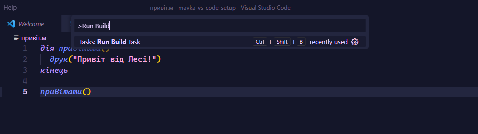
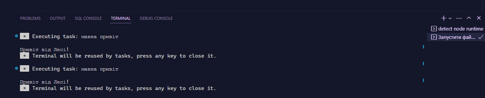

# mavka-vs-code-setup

Цей репозиторій містить конфігурацію для запуску файлу [Мавки](https://xn--80aaf6ah.xn--j1amh/) у редакторі VS Code.

> **Note**
> Для того, щоб запустити Мавку, вам необхідно [встановити її](#встановлення-мавки).

Для того, щоб використати конфігурацію, скопіюйте `.vscode` до кореневого каталогу свого проєкту.

Також можна налаштувати конфігурацію, використовуючи скрипти пакетного менеджера NPM, як це зробити
можна переглянути [ось тут](https://github.com/dkostmii/mavka-npm-setup).

## Запуск завдання за замовчуванням (Default Task)

1. Натисніть `Ctrl+Shift+P` (Windows) або `Command (⌘)+Shift+P` (MacOS)
для відкриття палітри команд.

2. Почніть вводити `Run Build Task`

    > **Note**
    > Зверніть увагу, ви можете використовувати набір клавіш `Ctrl+Shift+B`,
    > аби одразу запустити завдання за замовчуванням.

    З'явиться наступне вікно: 

3. Натисність Enter, після чого відобразиться панель з результатом виконання завдання:

    

## Встановлення Мавки

Необхідно встановити NodeJS та пакетний менеджер NPM.

Встановлення Мавки, як пакет NPM (глобально):

```bash
npm i -g mavka
```

Для підсвітки синтаксису та підказок, встановіть розширення [Мавка](https://marketplace.visualstudio.com/items?itemName=mavka.mavka-vscode) для VS Code.
